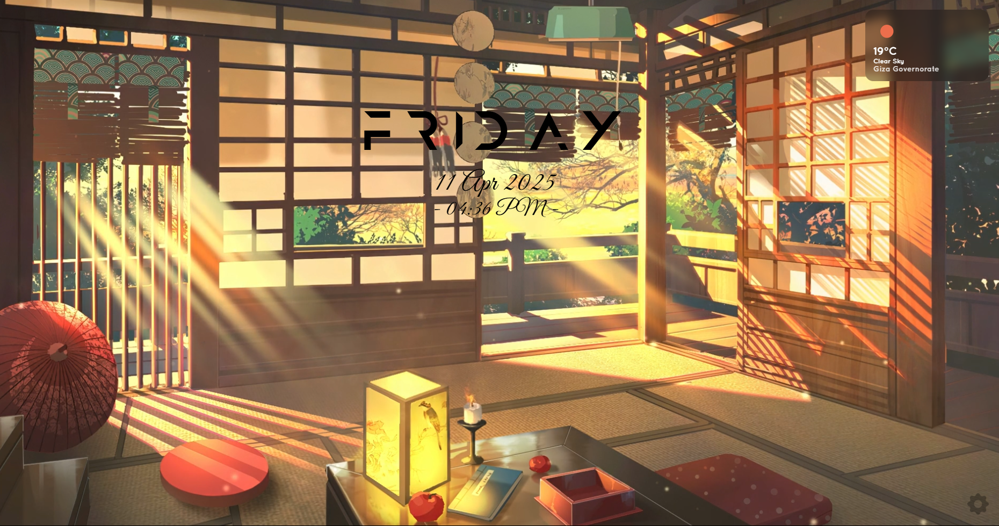

# URTab: A Customizable New Tab Page for Brave/Chrome Browser

URTab is a modern, highly customizable new tab page extension that transforms your browsing experience with a clean, minimalist design and powerful features.

## ✨ Features

### 🎨 Modern UI
- Glass-morphism design with blur effects
- Smooth transitions and animations
- Responsive layout for all devices
- Dark/Light mode support
- Custom scrollbar styling

### 🔧 Customization
- Background customization options
- Adjustable widget positions
- Multiple view options for sites
- Customizable color schemes
- Flexible layout options

### ⚡ Widgets
#### Clock & Date
- Multiple formats
- Customizable position
- Optional seconds display
- 12/24 hour format

#### Sites Widget
- Multiple view options:
  - Grid view
  - List view
  - Compact view
- Site sources:
  - Recent sites
  - Most visited sites
  - Custom sites
  - Bookmark folders
- Visibility options:
  - Always visible
  - Hidden
  - Hover-only
  - Click-to-show
- Flexible positioning:
  - Top-left
  - Top-right
  - Bottom-left
  - Bottom-right
  - Center

### 🚀 Performance
- Optimized animations
- Fast loading times
- Efficient state management
- Smooth transitions

## 🛠️ Installation

1. Clone the repository:
\`\`\`bash
git clone https://github.com/yourusername/URTab.git
\`\`\`

2. Open Chrome/Brave and navigate to:
   - Chrome: chrome://extensions
   - Brave: brave://extensions

3. Enable "Developer mode"

4. Click "Load unpacked" and select the URTab folder

## 📖 Usage

### Basic Setup
1. Open a new tab to see URTab in action
2. Click the settings icon (⚙️) to customize your experience
3. Choose your preferred background and widgets

### Widget Configuration
- **Sites Widget**: 
  - Choose view type (grid/list/compact)
  - Select site sources
  - Set visibility options
  - Adjust position
  - Customize appearance

- **Clock Widget**:
  - Select format
  - Choose position
  - Adjust size
  - Set color

### Customization Tips
- Use drag and drop to position widgets
- Right-click widgets for quick options
- Double-click to edit widget settings
- Use keyboard shortcuts for quick access

## ⌨️ Keyboard Shortcuts
- `Esc` - Close settings
- `Ctrl + ,` - Open settings
- `Ctrl + R` - Reset layout
- `Ctrl + H` - Toggle sites widget

## 🔄 Updates
See [CHANGELOG.md](CHANGELOG.md) for detailed version history and updates.

## 🙏 Acknowledgments
- Icons by [Feather Icons](https://feathericons.com/)
- Glass-morphism effects inspired by [Glass UI](https://ui.glass/)

## 🐛 Bug Reports
Create an issue for bug reports

## 🔮 Roadmap
- Theme customization
- More widget types
- Enhanced animations
- Better mobile support
- Additional customization options
- Performance improvements
- Better accessibility features

---
Made with ❤️ by AQRAM

## TODO List

- ~~Try **IndexedDB** for larger background storage or set a limit of 5MB.~~
- ~~Change the background color and style for the settings popup.~~
- ~~Add a **Reset to Defaults** button to restore original settings.~~
- ~~Fix (12 hr) formation.~~
- ~~Fix the issue where the time does not change position after being freely dragged.~~
- ~~Add an option to show/hide the clock~~
- ~~Add a day to the date~~
- ~~Add some fonts, formats, positions~~
- ~~Clean up the settings popup~~
- ~~Set up the Default settings.~~
- ~~Increase background limit to 500MB.~~
- ~~Clean and optimize the code.~~
- ~~Implement **Weather Widget**.~~
- [ ] Implement an **Welcome Page**.
